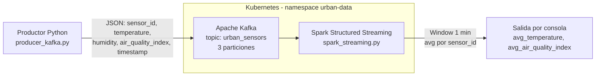
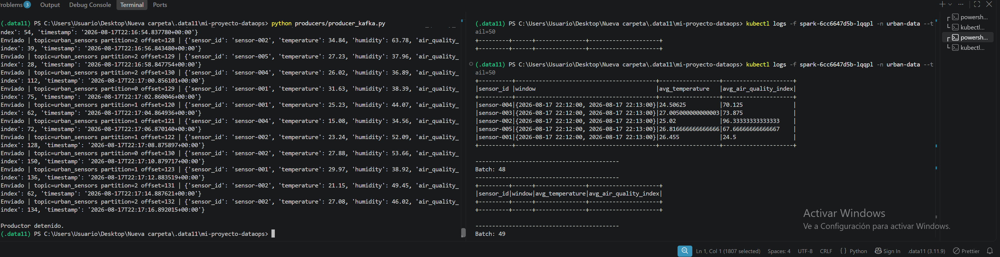

# DataOps con Terraform & AWS

## Checkpoint de Infraestructura Base

Este proyecto implementa la infraestructura base para una plataforma DataOps utilizando Terraform y AWS.

La arquitectura está diseñada siguiendo principios de modularidad, seguridad, mínimo privilegio y separación entre el backend de Terraform y el entorno de desarrollo.

## Arquitectura

La infraestructura está dividida en dos componentes principales:

### Bootstrap

El directorio `bootstrap/` crea la infraestructura necesaria para almacenar el estado remoto de Terraform:

* Bucket S3 para Terraform State.
* Versionado del bucket.
* Cifrado del estado mediante SSE.
* Tabla DynamoDB para State Locking.

### Environment Dev

El directorio `environments/dev/` contiene la infraestructura principal del entorno de desarrollo.

Incluye:

* VPC privada.
* Dos subredes privadas distribuidas en diferentes Availability Zones.
* Route Table privada.
* S3 Gateway VPC Endpoint.
* Bucket S3 para la capa RAW del Data Lake.
* Rol IAM para procesamiento de datos.
* Rol IAM de auditoría de solo lectura.

## Estructura del proyecto

```text
mi-proyecto-dataops/
│
├── .gitignore
├── README.md
├── PLAN_OUTPUT.md
│
├── bootstrap/
│   ├── main.tf
│   ├── variables.tf
│   └── outputs.tf
│
└── environments/
    └── dev/
        ├── main.tf
        ├── provider.tf
        ├── variables.tf
        ├── outputs.tf
        │
        └── modules/
            ├── network/
            │   ├── main.tf
            │   ├── variables.tf
            │   └── outputs.tf
            │
            └── identity/
                ├── main.tf
                ├── variables.tf
                └── outputs.tf
```

## Requisitos

* Terraform >= 1.5
* AWS CLI
* Cuenta de AWS
* Credenciales AWS configuradas

## Configuración de AWS

Configurar las credenciales mediante:

```powershell
aws configure
```

Validar la identidad:

```powershell
aws sts get-caller-identity
```

## Despliegue del Bootstrap

Desde la raíz del proyecto:

```powershell
cd bootstrap
terraform init
terraform apply
```

Este proceso crea el bucket S3 y la tabla DynamoDB utilizados como backend remoto.

## Despliegue del entorno Dev

Ingresar al entorno:

```powershell
cd ..\environments\dev
```

Inicializar Terraform:

```powershell
terraform init
```

Validar la configuración:

```powershell
terraform validate
```

Generar el plan:

```powershell
terraform plan
```

Generar el archivo requerido para la entrega:

```powershell
terraform plan -no-color > ..\..\PLAN_OUTPUT.md
```

## Red

El módulo `network` crea:

* Una VPC con CIDR `10.0.0.0/16`.
* Dos subredes privadas.
* Subredes distribuidas en diferentes Availability Zones.
* Una tabla de rutas privada.
* Un S3 Gateway VPC Endpoint.

Las subredes privadas no poseen una ruta directa hacia Internet mediante Internet Gateway.

El acceso a S3 se realiza mediante el Gateway Endpoint.

## Identidad y Seguridad

El módulo `identity` implementa dos roles principales.

### Data Processing Role

El rol de procesamiento está diseñado para futuros servicios como Lambda y Kinesis Data Analytics/Flink.

Los permisos S3 están limitados a:

```text
s3:ListBucket
s3:GetObject
s3:PutObject
```

sobre el prefijo definido para los datos RAW.

### Control Plane Audit Role

El rol de auditoría está diseñado para tareas de observabilidad y auditoría.

Sus permisos son exclusivamente de lectura, utilizando acciones como:

```text
ec2:Describe*
s3:Get*
s3:List*
iam:Get*
iam:List*
cloudwatch:Describe*
cloudwatch:Get*
cloudwatch:List*
```

No posee permisos para crear, modificar o eliminar recursos.

## Backend Remoto

Terraform utiliza un backend S3 remoto con:

* Cifrado SSE.
* Versionado del estado.
* DynamoDB para State Locking.
* Separación del estado del entorno `dev`.

El estado del entorno se almacena bajo:

```text
dev/infrastructure-base.tfstate
```

## Validación

Antes de realizar cambios se recomienda ejecutar:

```powershell
terraform fmt -recursive
terraform validate
terraform plan
```

## Limpieza

Para eliminar la infraestructura del entorno de desarrollo:

```powershell
cd environments\dev
terraform destroy
```

El backend de Terraform debe eliminarse únicamente cuando ya no sea necesario:

```powershell
cd ..\..\bootstrap
terraform destroy
```

## Seguridad

El repositorio no debe contener:

* Credenciales AWS.
* Access Keys.
* Secret Keys.
* Archivos `.tfstate`.
* Directorios `.terraform`.
* Archivos `.tfvars` con información sensible.
* Llaves privadas.

El archivo `.gitignore` contiene las exclusiones necesarias para evitar que estos archivos sean publicados en el repositorio.

# DataOps - Entrega 2

## 1. Descripción del proyecto

En esta segunda entrega se implementó una arquitectura de ingesta de datos
utilizando infraestructura como código mediante Terraform y servicios de AWS.

La arquitectura implementada permite recibir eventos mediante Amazon Kinesis
Data Streams y enviarlos hacia un Data Lake en Amazon S3 mediante Amazon
Kinesis Data Firehose.

La infraestructura se encuentra organizada mediante módulos Terraform.

---

## 2. Arquitectura implementada

La arquitectura está compuesta por:

- Amazon VPC
- Subnets privadas
- VPC Endpoint para S3
- Amazon S3 como Data Lake RAW
- Amazon Kinesis Data Streams
- Amazon Kinesis Data Firehose
- AWS IAM
- Amazon CloudWatch
- Terraform
- Python + boto3 como productor de eventos

Flujo de datos:

Python Producer
       |
       v
Kinesis Data Streams
       |
       v
Kinesis Data Firehose
       |
       v
Amazon S3 - RAW
       |
       v
Data Lake

---

## 3. Infraestructura como código

La infraestructura fue implementada utilizando Terraform.

La configuración utiliza módulos para separar responsabilidades.

Los principales módulos son:

- network
- identity
- kinesis

El módulo Kinesis se encuentra en:

environments/dev/modules/kinesis/

y contiene:

modules/kinesis/
├── main.tf
├── variables.tf
└── outputs.tf

---

## 4. Kinesis Data Streams

Se implementó un Kinesis Data Stream denominado:

clicks-ecommerce

Características principales:

- 2 shards
- Retención de 24 horas
- Cifrado mediante AWS KMS
- Administración mediante Terraform

Configuración principal:

shard_count = 2
retention_period = 24
encryption_type = "KMS"

---

## 5. Kinesis Data Firehose

Se implementó un Kinesis Data Firehose denominado:

ingesta-clicks-ecommerce

El origen de datos es:

Kinesis Data Streams

El destino es:

Amazon S3

El Firehose utiliza:

- Buffer de 5 MB
- Intervalo de 60 segundos
- Compresión GZIP
- Prefijos dinámicos por año
- CloudWatch Logging

Los datos se almacenan en el bucket RAW utilizando una estructura similar a:

ingesta/year=YYYY/

Los errores utilizan:

ingesta-errores/

---

## 6. Amazon S3 Data Lake

El bucket utilizado como capa RAW es:

datalake-raw-dev-123456789012

Los eventos enviados por Kinesis Data Streams son entregados por
Kinesis Firehose hacia este bucket.

Los archivos son almacenados comprimidos utilizando GZIP.

---

## 7. IAM

Se implementaron roles y políticas IAM para controlar el acceso entre
los servicios involucrados.

Entre los permisos implementados se encuentran:

- Lectura desde Kinesis Data Streams
- Escritura en Amazon S3
- Acceso a CloudWatch Logs

El objetivo es mantener permisos específicos para cada componente de
la arquitectura.

---

## 8. CloudWatch

Se implementaron alarmas para monitorear posibles problemas de throughput
en Kinesis Data Streams.

Alarmas implementadas:

- kinesis-read-throttled-clicks-ecommerce
- kinesis-write-throttled-clicks-ecommerce

Estas alarmas permiten detectar excedentes de capacidad de lectura o escritura.

---

## 9. Productor Python

Se desarrolló un productor utilizando Python y boto3.

Archivo:

producers/producer_kinesis.py

El productor genera y envía 100 eventos al stream:

clicks-ecommerce

Ejemplo de salida:

1/100 - User: user-1 - Shard: shardId-...
2/100 - User: user-2 - Shard: shardId-...
...
100/100 - User: user-100 - Shard: shardId-...

Ingesta finalizada: 100 eventos enviados.

---

## 10. Verificación de la ingesta

La existencia del stream se verificó mediante AWS CLI:

aws kinesis list-streams --region us-east-1

El stream utilizado es:

clicks-ecommerce

La existencia del Firehose se verificó mediante:

aws firehose list-delivery-streams --region us-east-1

El delivery stream utilizado es:

ingesta-clicks-ecommerce

La llegada de los datos a S3 se verificó mediante:

aws s3 ls s3://datalake-raw-dev-123456789012/ingesta/ --recursive

---

## 11. Terraform

La infraestructura fue desplegada mediante Terraform.

Validación:

terraform validate

Plan:

terraform plan -out=tfplan

Aplicación:

terraform apply "tfplan"

Terraform utiliza un backend remoto S3 para almacenar el estado.

El bloqueo del estado se gestiona mediante DynamoDB.

---

## 12. Estructura del proyecto

mi-proyecto-dataops/
│
├── bootstrap/
│
├── environments/
│   └── dev/
│       └── modules/
│           ├── identity/
│           ├── network/
│           └── kinesis/
│
├── producers/
│   └── producer_kinesis.py
│
├── .gitignore
└── README.md

---

## 13. Evidencias

Como evidencia de la implementación se dispone de:

- Terraform plan exitoso
- Terraform apply exitoso
- Kinesis Data Stream creado
- Kinesis Firehose creado
- 100 eventos enviados mediante Python/boto3
- Bucket S3 utilizado como destino RAW
- Alarmas de CloudWatch configuradas

---

## 14. Tecnologías utilizadas

- Terraform
- AWS
- Amazon S3
- Amazon Kinesis Data Streams
- Amazon Kinesis Data Firehose
- AWS IAM
- Amazon CloudWatch
- Python
- boto3
- PowerShell
- Git / GitHub

# DataOps - Entrega 3

## 1. Descripción del proyecto

En esta tercera entrega se implementó una plataforma de procesamiento
distribuido en tiempo real utilizando Kubernetes como orquestador,
Apache Kafka como bus de eventos y Apache Spark Structured Streaming
para el procesamiento de métricas de sensores urbanos.

---

## 2. Arquitectura implementada



Componentes:

- Namespace dedicado `urban-data`
- ConfigMap para variables de entorno de Kafka y Spark
- Deployment + Service de Kafka
- Deployment de Spark (Structured Streaming)
- Productor Python (fuera del cluster, vía port-forward)

---

## 3. Infraestructura Kubernetes

Los manifiestos se encuentran en `k8s/`:

```text
k8s/
├── namespace.yaml
├── configmap.yaml
├── kafka.yaml
├── kafka-service.yaml
└── spark.yaml
```

Despliegue, en orden:

```powershell
kubectl apply -f k8s/namespace.yaml
kubectl apply -f k8s/configmap.yaml
kubectl apply -f k8s/kafka.yaml
kubectl apply -f k8s/kafka-service.yaml
kubectl apply -f k8s/spark.yaml
```

Verificación:

```powershell
kubectl get pods -n urban-data
kubectl get svc -n urban-data
```

---

## 4. Kafka - Tópico urban_sensors

Se creó el tópico `urban_sensors` con 3 particiones:

```powershell
kubectl exec -it <pod-kafka> -n urban-data -- bash
/opt/kafka/bin/kafka-topics.sh --bootstrap-server localhost:9092 --describe --topic urban_sensors
```

```text
Topic: urban_sensors   PartitionCount: 3   ReplicationFactor: 1
```

---

## 5. Productor Kafka

Archivo: `producers/producer_kafka.py`

El productor genera eventos JSON simulando sensores urbanos y los envía
al tópico `urban_sensors`:

```json
{
  "sensor_id": "sensor-001",
  "temperature": 23.45,
  "humidity": 60.12,
  "air_quality_index": 85,
  "timestamp": "2026-08-17T22:06:25.217082+00:00"
}
```

Para conectar desde fuera del cluster, se expone el servicio mediante
port-forward:

```powershell
kubectl port-forward svc/kafka -n urban-data 29092:29092
```

Ejecución del productor:

```powershell
python producers/producer_kafka.py
```

---

## 6. Procesamiento con Spark Structured Streaming

Archivo: `spark/spark_streaming.py`

El job consume del tópico `urban_sensors`, parsea el JSON según schema,
y calcula agregaciones mediante ventana de tiempo (windowing) de 1 minuto:

- Promedio de `temperature` por `sensor_id`
- Promedio de `air_quality_index` por `sensor_id`

Ejecución dentro del cluster:

```powershell
kubectl logs -f <pod-spark> -n urban-data
```

---

## 7. Evidencia de comunicación Kafka - Spark

La siguiente captura muestra, en simultáneo:

- El productor enviando eventos JSON al tópico `urban_sensors`
- Spark procesando los datos y calculando el promedio de temperatura
  y calidad del aire agrupado por `sensor_id`, en ventanas de 1 minuto



---

## 8. Estructura del proyecto (Entrega 3)

```text
mi-proyecto-dataops/
│
├── k8s/
│   ├── namespace.yaml
│   ├── configmap.yaml
│   ├── kafka.yaml
│   ├── kafka-service.yaml
│   └── spark.yaml
│
├── producers/
│   └── producer_kafka.py
│
├── spark/
│   └── spark_streaming.py
│
├── evidence/
│   └── kafka-spark-evidence.png
│
└── README.md
```

---

## 9. Tecnologías utilizadas

- Kubernetes (Docker Desktop)
- Apache Kafka
- Apache Spark Structured Streaming
- Python (kafka-python)
- PySpark
- Git / GitHub