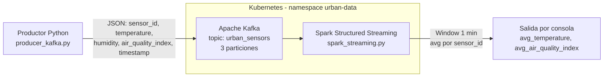
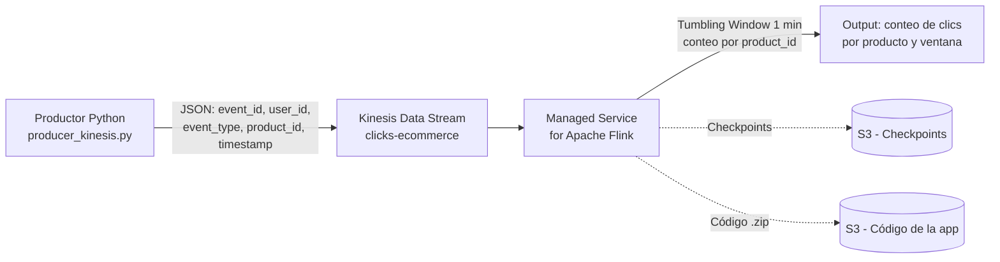
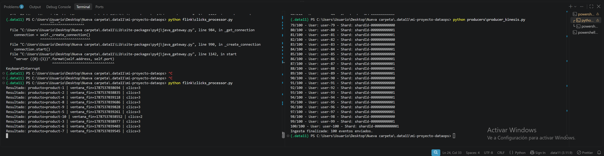
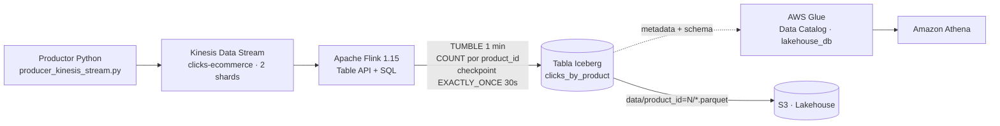
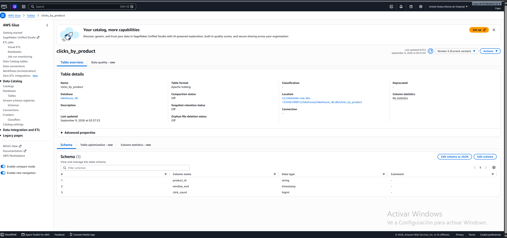
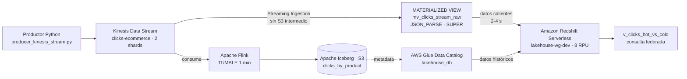
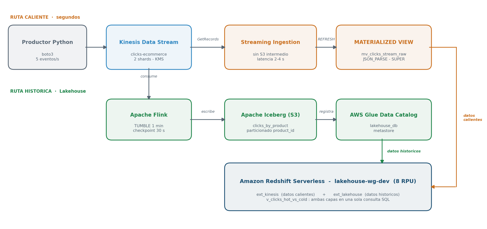
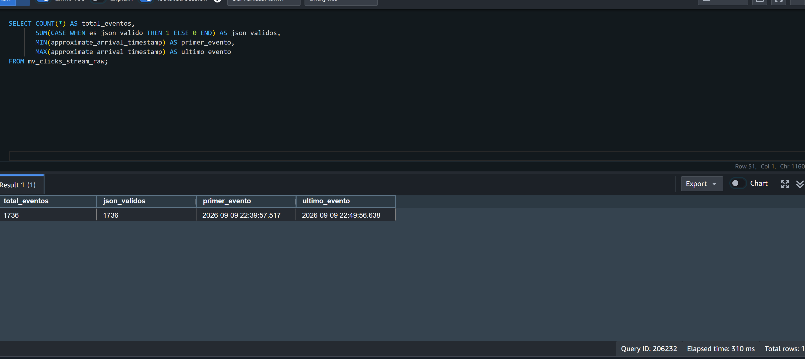
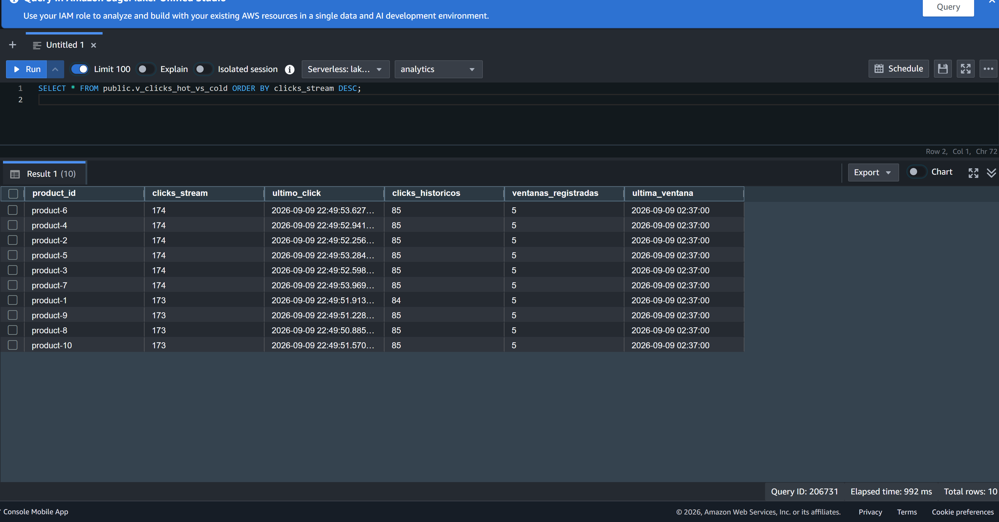
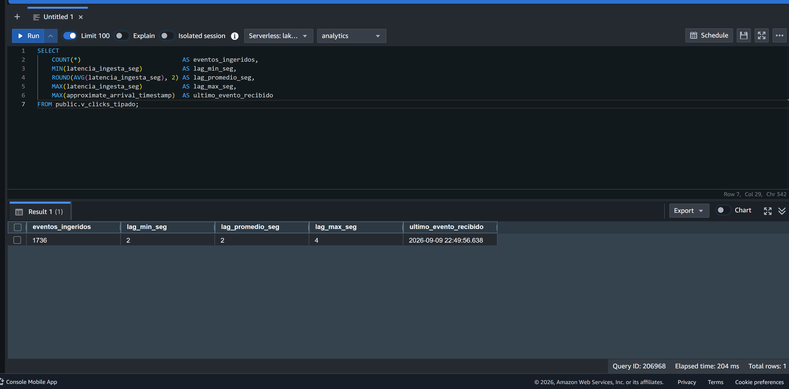

> **Nota sobre la estructura del repositorio (a partir de la Entrega 5)**
>
> El repositorio se reorganizó en dos carpetas de primer nivel:
>
> - **`infra/`** — toda la infraestructura como código: `bootstrap/`, `environments/dev/`
>   (con `main.tf` y los módulos Terraform) y `k8s/`.
> - **`app/`** — todo el código de aplicación: `flink/`, `producers/`, `spark/` y `redshift/`.
>
> Las rutas mencionadas en las Entregas 1 a 4 deben leerse con ese prefijo:
> `bootstrap/` es ahora `infra/bootstrap/`, `environments/dev/` es
> `infra/environments/dev/`, `flink/` es `app/flink/`, y así sucesivamente.

# DataOps - Entrega 1
## DataOps con Terraform & AWS

## Checkpoint de Infraestructura Base

Este proyecto implementa la infraestructura base para una plataforma DataOps utilizando Terraform y AWS.

La arquitectura está diseñada siguiendo principios de modularidad, seguridad, mínimo privilegio y separación entre el backend de Terraform y el entorno de desarrollo.

## Arquitectura

La infraestructura está dividida en dos componentes principales:

### Bootstrap

El directorio `bootstrap/` crea la infraestructura necesaria para almacenar el estado remoto de Terraform:

* Bucket S3 para Terraform State.
* Versionado del bucket.
* Cifrado del estado mediante SSE.
* Tabla DynamoDB para State Locking.

### Environment Dev

El directorio `environments/dev/` contiene la infraestructura principal del entorno de desarrollo.

Incluye:

* VPC privada.
* Dos subredes privadas distribuidas en diferentes Availability Zones.
* Route Table privada.
* S3 Gateway VPC Endpoint.
* Bucket S3 para la capa RAW del Data Lake.
* Rol IAM para procesamiento de datos.
* Rol IAM de auditoría de solo lectura.

## Estructura del proyecto

```text
mi-proyecto-dataops/
│
├── .gitignore
├── README.md
├── PLAN_OUTPUT.md
│
├── bootstrap/
│   ├── main.tf
│   ├── variables.tf
│   └── outputs.tf
│
└── environments/
    └── dev/
        ├── main.tf
        ├── provider.tf
        ├── variables.tf
        ├── outputs.tf
        │
        └── modules/
            ├── network/
            │   ├── main.tf
            │   ├── variables.tf
            │   └── outputs.tf
            │
            └── identity/
                ├── main.tf
                ├── variables.tf
                └── outputs.tf
```

## Requisitos

* Terraform >= 1.5
* AWS CLI
* Cuenta de AWS
* Credenciales AWS configuradas

## Configuración de AWS

Configurar las credenciales mediante:

```powershell
aws configure
```

Validar la identidad:

```powershell
aws sts get-caller-identity
```

## Despliegue del Bootstrap

Desde la raíz del proyecto:

```powershell
cd bootstrap
terraform init
terraform apply
```

Este proceso crea el bucket S3 y la tabla DynamoDB utilizados como backend remoto.

## Despliegue del entorno Dev

Ingresar al entorno:

```powershell
cd ..\environments\dev
```

Inicializar Terraform:

```powershell
terraform init
```

Validar la configuración:

```powershell
terraform validate
```

Generar el plan:

```powershell
terraform plan
```

Generar el archivo requerido para la entrega:

```powershell
terraform plan -no-color > ..\..\PLAN_OUTPUT.md
```

## Red

El módulo `network` crea:

* Una VPC con CIDR `10.0.0.0/16`.
* Dos subredes privadas.
* Subredes distribuidas en diferentes Availability Zones.
* Una tabla de rutas privada.
* Un S3 Gateway VPC Endpoint.

Las subredes privadas no poseen una ruta directa hacia Internet mediante Internet Gateway.

El acceso a S3 se realiza mediante el Gateway Endpoint.

## Identidad y Seguridad

El módulo `identity` implementa dos roles principales.

### Data Processing Role

El rol de procesamiento está diseñado para futuros servicios como Lambda y Kinesis Data Analytics/Flink.

Los permisos S3 están limitados a:

```text
s3:ListBucket
s3:GetObject
s3:PutObject
```

sobre el prefijo definido para los datos RAW.

### Control Plane Audit Role

El rol de auditoría está diseñado para tareas de observabilidad y auditoría.

Sus permisos son exclusivamente de lectura, utilizando acciones como:

```text
ec2:Describe*
s3:Get*
s3:List*
iam:Get*
iam:List*
cloudwatch:Describe*
cloudwatch:Get*
cloudwatch:List*
```

No posee permisos para crear, modificar o eliminar recursos.

## Backend Remoto

Terraform utiliza un backend S3 remoto con:

* Cifrado SSE.
* Versionado del estado.
* DynamoDB para State Locking.
* Separación del estado del entorno `dev`.

El estado del entorno se almacena bajo:

```text
dev/infrastructure-base.tfstate
```

## Validación

Antes de realizar cambios se recomienda ejecutar:

```powershell
terraform fmt -recursive
terraform validate
terraform plan
```

## Limpieza

Para eliminar la infraestructura del entorno de desarrollo:

```powershell
cd environments\dev
terraform destroy
```

El backend de Terraform debe eliminarse únicamente cuando ya no sea necesario:

```powershell
cd ..\..\bootstrap
terraform destroy
```

## Seguridad

El repositorio no debe contener:

* Credenciales AWS.
* Access Keys.
* Secret Keys.
* Archivos `.tfstate`.
* Directorios `.terraform`.
* Archivos `.tfvars` con información sensible.
* Llaves privadas.

El archivo `.gitignore` contiene las exclusiones necesarias para evitar que estos archivos sean publicados en el repositorio.

# DataOps - Entrega 2

## 1. Descripción del proyecto

En esta segunda entrega se implementó una arquitectura de ingesta de datos
utilizando infraestructura como código mediante Terraform y servicios de AWS.

La arquitectura implementada permite recibir eventos mediante Amazon Kinesis
Data Streams y enviarlos hacia un Data Lake en Amazon S3 mediante Amazon
Kinesis Data Firehose.

La infraestructura se encuentra organizada mediante módulos Terraform.

---

## 2. Arquitectura implementada

La arquitectura está compuesta por:

- Amazon VPC
- Subnets privadas
- VPC Endpoint para S3
- Amazon S3 como Data Lake RAW
- Amazon Kinesis Data Streams
- Amazon Kinesis Data Firehose
- AWS IAM
- Amazon CloudWatch
- Terraform
- Python + boto3 como productor de eventos

Flujo de datos:

Python Producer
       |
       v
Kinesis Data Streams
       |
       v
Kinesis Data Firehose
       |
       v
Amazon S3 - RAW
       |
       v
Data Lake

---

## 3. Infraestructura como código

La infraestructura fue implementada utilizando Terraform.

La configuración utiliza módulos para separar responsabilidades.

Los principales módulos son:

- network
- identity
- kinesis

El módulo Kinesis se encuentra en:

environments/dev/modules/kinesis/

y contiene:

modules/kinesis/
├── main.tf
├── variables.tf
└── outputs.tf

---

## 4. Kinesis Data Streams

Se implementó un Kinesis Data Stream denominado:

clicks-ecommerce

Características principales:

- 2 shards
- Retención de 24 horas
- Cifrado mediante AWS KMS
- Administración mediante Terraform

Configuración principal:

shard_count = 2
retention_period = 24
encryption_type = "KMS"

---

## 5. Kinesis Data Firehose

Se implementó un Kinesis Data Firehose denominado:

ingesta-clicks-ecommerce

El origen de datos es:

Kinesis Data Streams

El destino es:

Amazon S3

El Firehose utiliza:

- Buffer de 5 MB
- Intervalo de 60 segundos
- Compresión GZIP
- Prefijos dinámicos por año
- CloudWatch Logging

Los datos se almacenan en el bucket RAW utilizando una estructura similar a:

ingesta/year=YYYY/

Los errores utilizan:

ingesta-errores/

---

## 6. Amazon S3 Data Lake

El bucket utilizado como capa RAW es:

datalake-raw-dev-123456789012

Los eventos enviados por Kinesis Data Streams son entregados por
Kinesis Firehose hacia este bucket.

Los archivos son almacenados comprimidos utilizando GZIP.

---

## 7. IAM

Se implementaron roles y políticas IAM para controlar el acceso entre
los servicios involucrados.

Entre los permisos implementados se encuentran:

- Lectura desde Kinesis Data Streams
- Escritura en Amazon S3
- Acceso a CloudWatch Logs

El objetivo es mantener permisos específicos para cada componente de
la arquitectura.

---

## 8. CloudWatch

Se implementaron alarmas para monitorear posibles problemas de throughput
en Kinesis Data Streams.

Alarmas implementadas:

- kinesis-read-throttled-clicks-ecommerce
- kinesis-write-throttled-clicks-ecommerce

Estas alarmas permiten detectar excedentes de capacidad de lectura o escritura.

---

## 9. Productor Python

Se desarrolló un productor utilizando Python y boto3.

Archivo:

producers/producer_kinesis.py

El productor genera y envía 100 eventos al stream:

clicks-ecommerce

Ejemplo de salida:

1/100 - User: user-1 - Shard: shardId-...
2/100 - User: user-2 - Shard: shardId-...
...
100/100 - User: user-100 - Shard: shardId-...

Ingesta finalizada: 100 eventos enviados.

---

## 10. Verificación de la ingesta

La existencia del stream se verificó mediante AWS CLI:

aws kinesis list-streams --region us-east-1

El stream utilizado es:

clicks-ecommerce

La existencia del Firehose se verificó mediante:

aws firehose list-delivery-streams --region us-east-1

El delivery stream utilizado es:

ingesta-clicks-ecommerce

La llegada de los datos a S3 se verificó mediante:

aws s3 ls s3://datalake-raw-dev-123456789012/ingesta/ --recursive

---

## 11. Terraform

La infraestructura fue desplegada mediante Terraform.

Validación:

terraform validate

Plan:

terraform plan -out=tfplan

Aplicación:

terraform apply "tfplan"

Terraform utiliza un backend remoto S3 para almacenar el estado.

El bloqueo del estado se gestiona mediante DynamoDB.

---

## 12. Estructura del proyecto

mi-proyecto-dataops/
│
├── bootstrap/
│
├── environments/
│   └── dev/
│       └── modules/
│           ├── identity/
│           ├── network/
│           └── kinesis/
│
├── producers/
│   └── producer_kinesis.py
│
├── .gitignore
└── README.md

---

## 13. Evidencias

Como evidencia de la implementación se dispone de:

- Terraform plan exitoso
- Terraform apply exitoso
- Kinesis Data Stream creado
- Kinesis Firehose creado
- 100 eventos enviados mediante Python/boto3
- Bucket S3 utilizado como destino RAW
- Alarmas de CloudWatch configuradas

---

## 14. Tecnologías utilizadas

- Terraform
- AWS
- Amazon S3
- Amazon Kinesis Data Streams
- Amazon Kinesis Data Firehose
- AWS IAM
- Amazon CloudWatch
- Python
- boto3
- PowerShell
- Git / GitHub

# DataOps - Entrega 3

## 1. Descripción del proyecto

En esta tercera entrega se implementó una plataforma de procesamiento
distribuido en tiempo real utilizando Kubernetes como orquestador,
Apache Kafka como bus de eventos y Apache Spark Structured Streaming
para el procesamiento de métricas de sensores urbanos.

---

## 2. Arquitectura implementada



Componentes:

- Namespace dedicado `urban-data`
- ConfigMap para variables de entorno de Kafka y Spark
- Deployment + Service de Kafka
- Deployment de Spark (Structured Streaming)
- Productor Python (fuera del cluster, vía port-forward)

---

## 3. Infraestructura Kubernetes

Los manifiestos se encuentran en `k8s/`:

```text
k8s/
├── namespace.yaml
├── configmap.yaml
├── kafka.yaml
├── kafka-service.yaml
└── spark.yaml
```

Despliegue, en orden:

```powershell
kubectl apply -f k8s/namespace.yaml
kubectl apply -f k8s/configmap.yaml
kubectl apply -f k8s/kafka.yaml
kubectl apply -f k8s/kafka-service.yaml
kubectl apply -f k8s/spark.yaml
```

Verificación:

```powershell
kubectl get pods -n urban-data
kubectl get svc -n urban-data
```

---

## 4. Kafka - Tópico urban_sensors

Se creó el tópico `urban_sensors` con 3 particiones:

```powershell
kubectl exec -it <pod-kafka> -n urban-data -- bash
/opt/kafka/bin/kafka-topics.sh --bootstrap-server localhost:9092 --describe --topic urban_sensors
```

```text
Topic: urban_sensors   PartitionCount: 3   ReplicationFactor: 1
```

---

## 5. Productor Kafka

Archivo: `producers/producer_kafka.py`

El productor genera eventos JSON simulando sensores urbanos y los envía
al tópico `urban_sensors`:

```json
{
  "sensor_id": "sensor-001",
  "temperature": 23.45,
  "humidity": 60.12,
  "air_quality_index": 85,
  "timestamp": "2026-08-17T22:06:25.217082+00:00"
}
```

Para conectar desde fuera del cluster, se expone el servicio mediante
port-forward:

```powershell
kubectl port-forward svc/kafka -n urban-data 29092:29092
```

Ejecución del productor:

```powershell
python producers/producer_kafka.py
```

---

## 6. Procesamiento con Spark Structured Streaming

Archivo: `spark/spark_streaming.py`

El job consume del tópico `urban_sensors`, parsea el JSON según schema,
y calcula agregaciones mediante ventana de tiempo (windowing) de 1 minuto:

- Promedio de `temperature` por `sensor_id`
- Promedio de `air_quality_index` por `sensor_id`

Ejecución dentro del cluster:

```powershell
kubectl logs -f <pod-spark> -n urban-data
```

---

## 7. Evidencia de comunicación Kafka - Spark

La siguiente captura muestra, en simultáneo:

- El productor enviando eventos JSON al tópico `urban_sensors`
- Spark procesando los datos y calculando el promedio de temperatura
  y calidad del aire agrupado por `sensor_id`, en ventanas de 1 minuto


---

## 8. Estructura del proyecto (Entrega 3)

```text
mi-proyecto-dataops/
│
├── k8s/
│   ├── namespace.yaml
│   ├── configmap.yaml
│   ├── kafka.yaml
│   ├── kafka-service.yaml
│   └── spark.yaml
│
├── producers/
│   └── producer_kafka.py
│
├── spark/
│   └── spark_streaming.py
│
├── evidence/
│   └── kafka-spark-evidence.png
│
└── README.md
```

---

## 9. Tecnologías utilizadas

- Kubernetes (Docker Desktop)
- Apache Kafka
- Apache Spark Structured Streaming
- Python (kafka-python)
- PySpark
- Git / GitHub


---

# DataOps - Entrega 4

## 1. Descripción del proyecto

En esta cuarta entrega se implementó la capa de procesamiento en tiempo real
utilizando Amazon Managed Service for Apache Flink, consumiendo del Kinesis
Data Stream `clicks-ecommerce` creado en el Módulo 2.

## 2. Lógica de negocio

La aplicación procesa eventos de clicks de e-commerce con la siguiente estructura:

```json
{
  "event_id": "uuid",
  "user_id": "user-1",
  "event_type": "click",
  "product_id": "product-1",
  "timestamp": "2026-08-23T22:53:58.123456+00:00"
}
```

**Lógica implementada:** conteo de clics por producto (`product_id`) en
ventanas de tiempo *Tumbling Event Time* de 1 minuto, usando estado por clave
(`KeyedState`). Esto permite identificar qué productos concentran más
actividad en cada intervalo de tiempo, en tiempo real.

## 3. Arquitectura



## 4. Watermarks y Event Time

Se implementó un `WatermarkStrategy` con las siguientes características:

- **Tolerancia a desorden:** `for_bounded_out_of_orderness(10 segundos)`,
  para absorber la latencia natural de red entre el productor y Kinesis.
- **Detección de inactividad:** `with_idleness(20 segundos)`, para que las
  ventanas se cierren igual aunque el productor deje de enviar eventos.
- **Extracción de timestamp:** se usa el campo `timestamp` del evento
  (event time), no el reloj del sistema (processing time), para reflejar
  cuándo ocurrió el click realmente.

## 5. Código de la aplicación

Archivo: `flink/clicks_processor.py`

Componentes principales:

- `FlinkKinesisConsumer`: consume del stream `clicks-ecommerce`.
- `ParseClickEvent` (MapFunction): parsea el JSON y extrae `(product_id, timestamp_ms, 1)`.
- `ClickTimestampAssigner`: asigna el event time para el watermark.
- `key_by(product_id)` + `TumblingEventTimeWindows.of(1 minuto)` + `SumClicks` (ReduceFunction):
  agrega el conteo de clics por producto y por ventana (estado por clave).

## 6. Infraestructura como código (Terraform)

Nuevo módulo: `environments/dev/modules/flink/`

Recursos definidos:

- `aws_kinesisanalyticsv2_application`: la aplicación de Flink en sí,
  configurada en runtime `FLINK-1_15`, con el código apuntando al `.zip`
  en S3.
- `aws_iam_role` + 4 políticas IAM acotadas: permisos específicos para leer
  del stream de Kinesis, leer el código desde S3, leer/escribir checkpoints
  en S3, y escribir logs en CloudWatch (principio de mínimo privilegio).
- `checkpoint_configuration`: checkpointing habilitado (`checkpointing_enabled = true`),
  con intervalo de 60 segundos, para garantizar recuperación de estado ante fallos.
- `monitoring_configuration`: nivel de log `INFO` y métricas a nivel `APPLICATION`.
- `parallelism_configuration`: paralelismo de 1 (ajustable vía `parallelism_per_kpu`
  según la carga esperada).
- `aws_cloudwatch_log_group` / `aws_cloudwatch_log_stream`: destino de logs de la app.

### Despliegue (infraestructura definida, no aplicada en este entorno)

```powershell
cd environments/dev
terraform init
terraform validate
terraform plan
```

> **Nota:** por motivos de costo (Managed Service for Apache Flink cobra por
> KPU-hora de forma continua), la infraestructura fue validada con
> `terraform plan` (0 errores, 8 recursos a crear) pero no desplegada de
> forma persistente en este entorno. La lógica de procesamiento fue
> validada localmente contra el stream real de Kinesis en AWS (ver
> evidencia más abajo).

## 7. Empaquetado del código

```powershell
Compress-Archive -Path flink\clicks_processor.py -DestinationPath flink\clicks_processor.zip -Force
```

El resultado (`flink/clicks_processor.zip`) es el artefacto que
`aws_kinesisanalyticsv2_application` espera encontrar en S3
(`code_content.s3_content_location`).

## 8. Validación local contra Kinesis real

Para verificar que la lógica de Flink funciona correctamente antes de
desplegarla, se ejecutó el job localmente con PyFlink, consumiendo
directamente del stream `clicks-ecommerce` ya desplegado en AWS:

```powershell
python flink\clicks_processor.py
```

En paralelo, se ejecutó el productor real:

```powershell
python producers\producer_kinesis.py
```

## 9. Evidencia de ejecución

La siguiente captura muestra, en simultáneo:

- El productor enviando 100 eventos de clicks al stream `clicks-ecommerce`
- Flink procesando los eventos y calculando el conteo de clics por
  `product_id` en la ventana Tumbling de 1 minuto



## 10. Requisitos adicionales (setup local)

Para reproducir la validación local se necesita:

```powershell
pip install apache-flink==1.18.1
winget install EclipseAdoptium.Temurin.11.JDK
```

Descargar el conector de Kinesis para Flink (no se versiona en el repo por su tamaño):

```powershell
mkdir flink\lib
Invoke-WebRequest -Uri "https://repo1.maven.org/maven2/org/apache/flink/flink-sql-connector-kinesis/1.15.4/flink-sql-connector-kinesis-1.15.4.jar" -OutFile "flink\lib\flink-sql-connector-kinesis-1.15.4.jar"
```

## 11. Estructura del proyecto (Entrega 4)

```text
mi-proyecto-dataops/
│
├── flink/
│   ├── clicks_processor.py
│   ├── clicks_processor.zip
│   └── lib/                          (no versionado, ver .gitignore)
│       └── flink-sql-connector-kinesis-1.15.4.jar
│
├── environments/dev/modules/flink/
│   ├── main.tf
│   ├── variables.tf
│   └── output.tf
│
├── evidence/
│   └── flink-kinesis-evidence.png
│
└── README.md
```

## 12. Tecnologías utilizadas

- Amazon Managed Service for Apache Flink
- Apache Flink 1.15 (PyFlink)
- Amazon Kinesis Data Streams
- AWS IAM
- Amazon CloudWatch
- Terraform
- Python + boto3
- Git / GitHub

---

---

# DataOps - Entrega 5

## 1. Descripción del proyecto

En esta quinta entrega se implementó la **capa de almacenamiento y catálogo (Lakehouse)**:
la salida del pipeline de Flink dejó de ser un archivo plano huérfano en S3 y pasó a ser una
**tabla transaccional de Apache Iceberg**, registrada y gobernada en **AWS Glue Data Catalog**
y consultable desde **Amazon Athena**.

## 2. Arquitectura



## 3. Estructura del proyecto

```text
mi-proyecto-dataops/
│
├── infra/                                  Infraestructura como código
│   ├── bootstrap/                          Backend remoto de Terraform (S3 + DynamoDB)
│   ├── environments/
│   │   └── dev/
│   │       ├── main.tf                     Composición del entorno
│   │       ├── provider.tf
│   │       ├── variables.tf
│   │       ├── outputs.tf
│   │       └── modules/
│   │           ├── network/
│   │           ├── identity/
│   │           ├── kinesis/
│   │           ├── flink/
│   │           └── glue/                   ← Entrega 5: catálogo, IAM y lock
│   └── k8s/                                Manifiestos de la Entrega 3
│
├── app/                                    Código de aplicación
│   ├── flink/
│   │   ├── iceberg_processor.py            ← Entrega 5: Kinesis → Iceberg → Glue
│   │   ├── clicks_processor.py             Entrega 4
│   │   ├── lib/                            JAR del conector Kinesis (no versionado)
│   │   └── lib_iceberg/                    JAR de Iceberg + Hadoop (no versionado)
│   ├── producers/
│   │   ├── producer_kinesis_stream.py      ← Entrega 5: emisión continua
│   │   ├── producer_kinesis.py             Entrega 2
│   │   └── producer_kafka.py               Entrega 3
│   └── spark/
│       └── spark_streaming.py              Entrega 3
│
├── scripts/
│   └── verify_iceberg.ps1                  Verificación de los criterios de aceptación
│
├── docs/
│   └── preentrega5_lakehouse.md            Documentación técnica ampliada
│
├── evidence/                               Capturas y salidas de consola
├── .gitignore
└── README.md
```

## 4. Infraestructura como código (Terraform)

Módulo nuevo: `infra/environments/dev/modules/glue/`

| Recurso | Rol |
|---|---|
| `aws_glue_catalog_database.lakehouse_db` | Metastore central de las tablas Iceberg |
| `aws_iam_role_policy.flink_glue_access` | `glue:GetDatabase`, `GetTable`, `CreateTable`, `UpdateTable`, `DeleteTable`, `GetPartitions`, `BatchCreatePartition` |
| `aws_iam_role_policy.flink_lakehouse_s3_access` | `s3:GetObject`, `PutObject`, `DeleteObject`, `ListBucket` sobre el bucket del Lakehouse |
| `aws_dynamodb_table.iceberg_glue_lock` | Lock manager explícito para commits concurrentes |
| `aws_iam_role_policy.flink_iceberg_lock_access` | Acceso del rol de Flink a la tabla de lock |
| `aws_s3_bucket_versioning.raw_bucket_versioning` | Versionado del bucket (recomendado para Iceberg) |

El `account_id` de las políticas se resuelve con `data.aws_caller_identity.current`,
sin valores hardcodeados.

Despliegue:

```powershell
cd infra\environments\dev
terraform init
terraform validate
terraform plan
terraform apply
```

## 5. Estrategia de particionado y *partition pruning*

La tabla `clicks_by_product` está **particionada por `product_id`**.

La tabla es una agregación por ventana (`product_id`, `window_end`, `click_count`) y el patrón
de consulta dominante es *"¿cómo evolucionan los clics de este producto?"*, es decir, el filtro
casi siempre incluye `product_id`.

Iceberg guarda en los manifiestos el valor de partición y las estadísticas por columna
(min/max, nulos) de cada archivo de datos. Al ejecutar:

```sql
SELECT SUM(click_count) FROM lakehouse_db.clicks_by_product WHERE product_id = 'product-3';
```

el planner resuelve el filtro **contra los metadatos**, descarta las particiones que no aplican
y abre únicamente los Parquet de `data/product_id=product-3/`. Eso es *partition pruning*:
reduce el `DataScannedInBytes` — que es exactamente lo que Athena factura — sin recorrer el
resto de la tabla.

Criterios que sostienen la elección:

- **Cardinalidad controlada.** ~10 productos en el escenario de prueba: suficiente selectividad
  para podar, sin caer en el *small files problem* que produciría particionar por algo de
  cardinalidad alta (`user_id`, `event_id`).
- **`window_end` no se particiona.** Iceberg ya guarda min/max de esa columna por archivo, así
  que un filtro temporal se resuelve por *file pruning* con estadísticas. Si el volumen creciera,
  la evolución natural sería `PARTITIONED BY (product_id, days(window_end))` — y una ventaja
  clave de Iceberg es que ese cambio se hace con **partition evolution**, sin reescribir el
  histórico ni romper las consultas existentes (a diferencia de Hive).
- **Alineado con el paralelismo de escritura.** Con `product_id` como clave de agrupación, cada
  writer escribe en un set acotado de particiones por checkpoint, manteniendo bajo el número de
  archivos por commit.

## 6. Implementación en Flink

Archivo: `app/flink/iceberg_processor.py`

- Tabla fuente sobre `clicks-ecommerce` con el conector `kinesis` en formato `raw`, extrayendo
  los campos con `JSON_VALUE` en SQL y declarando `WATERMARK` sobre el event time.
- Catálogo Iceberg respaldado por Glue:
  `'catalog-impl' = 'org.apache.iceberg.aws.glue.GlueCatalog'` con `S3FileIO`.
- Tabla `clicks_by_product` en `format-version 2`, Parquet + zstd, particionada por `product_id`.
- `INSERT INTO` continuo con `TUMBLE` de 1 minuto agrupando por producto.
- **Checkpointing explícito**: `EXACTLY_ONCE` cada 30 s, `min_pause` 5 s, timeout 180 s y
  `tolerable_checkpoint_failure_number(0)`. El Iceberg Sink **sólo commitea los manifiestos
  cuando Flink completa un checkpoint**: sin esto, los Parquet quedan en S3 pero la tabla del
  catálogo aparece vacía.

## 7. Ejecución de la prueba de persistencia

```powershell
python -u app\flink\iceberg_processor.py
```

El script envía el job, **lanza el productor continuo automáticamente**, monitorea el estado de
los checkpoints vía la REST API del cluster local y se auto-cancela de forma limpia al terminar.

El productor emite de forma **sostenida**, no en ráfagas: con event time, una ventana `TUMBLE`
sólo cierra cuando llega un evento posterior al fin de la ventana. Un productor que envía 100
eventos y termina congela el watermark y la última ventana nunca dispara.

Verificación de los criterios de aceptación:

```powershell
.\scripts\verify_iceberg.ps1
```

## 8. Resultado verificado

Corrida del 2026-09-08, 23:31–23:38 (7 minutos, ~5 eventos/s):

| Criterio de aceptación | Resultado |
|---|---|
| Infraestructura declarativa | Catálogo, roles, versionado y lock definidos en Terraform |
| Formato Iceberg | `metadata_location` avanzó de `00000-*` a `00005-*`: **5 commits**, con 5 `snap-*.avro` y 5 manifiestos `*-m0.avro` |
| Consistencia | Athena devuelve las ventanas de un minuto con ~17 clics por producto, reflejando la agregación de Flink |
| Cero errores de concurrencia | 5 commits secuenciales sin `ConcurrentModificationException`; `metadata.json` creciendo de 2,7 KB a 7,8 KB |
| Partition pruning | Filtro por `product_id`: **230 bytes escaneados** frente al escaneo del total de particiones |

Se generaron **50 archivos Parquet** distribuidos en las 10 particiones `product_id=product-N/`.

### Concurrencia

`GlueCatalog` implementa *optimistic concurrency control* nativo: cada commit hace un
`UpdateTable` condicionado al `VersionId` actual de la tabla; si otro writer commiteó en el
medio, el commit se reintenta sobre el nuevo snapshot en vez de sobrescribirlo. Sobre esa base
se añadió `aws_dynamodb_table.iceberg_glue_lock` como lock manager explícito para escenarios
multi-writer, que se activa con:

```powershell
$env:USE_DYNAMO_LOCK = "1"
python -u app\flink\iceberg_processor.py
```

## 9. Compatibilidad de dependencias

| Componente | Versión |
|---|---|
| Flink / PyFlink | 1.15.4 |
| `flink-sql-connector-kinesis` | 1.15.4 |
| `iceberg-flink-runtime-1.15` | 1.4.2 |
| `iceberg-aws-bundle` | 1.4.2 |
| `hadoop-client-api` / `-runtime` | 3.3.4 |

### `LinkageError` de Dropwizard Metrics — el bloqueante real

Durante la puesta en marcha, el job escribía correctamente los Parquet en S3 pero **la tabla
del catálogo quedaba siempre vacía**. El síntoma era engañoso: `data/` se llenaba de Parquet
válidos, `metadata/` sólo tenía el JSON de creación, y Athena devolvía la tabla con el schema
correcto y cero filas.

La causa raíz apareció al capturar la excepción con `TableResult.wait()` en un hilo de
vigilancia — los logs del MiniCluster no la mostraban:

```
java.lang.LinkageError: loader constraint violation:
loader 'app' wants to load class com.codahale.metrics.Histogram.
A different class with the same name was previously loaded by ChildFirstClassLoader
  at org.apache.flink.dropwizard.metrics.DropwizardHistogramWrapper.update
  at org.apache.iceberg.flink.sink.IcebergStreamWriterMetrics.updateFlushResult
  at org.apache.iceberg.flink.sink.IcebergStreamWriter.flush
  at IcebergStreamWriter.prepareSnapshotPreBarrier
```

`iceberg-flink-runtime` trae **bundleado** `com.codahale.metrics`, y PyFlink ya expone
`flink-metrics-dropwizard` en su classpath de sistema. La misma clase queda cargada por dos
classloaders distintos y la JVM rechaza la operación cuando el writer de Iceberg registra las
métricas del flush.

El fallo ocurre en `prepareSnapshotPreBarrier`, es decir **sólo cuando hay datos reales que
escribir** — por eso las corridas sin tráfico completaban checkpoints sin problema y el error
parecía intermitente. Con la estrategia de reinicio por defecto, el job moría y revivía en
bucle, dejando decenas de *orphan files*: Parquet válidos que ningún snapshot referencia.

**Solución** — forzar resolución *parent-first* para esos paquetes, de modo que ambos
componentes usen la misma clase:

```python
conf.set_string(
    "classloader.parent-first-patterns.additional",
    "com.codahale.metrics;org.apache.flink.dropwizard",
)
```

Es un caso de libro del error común "mismatch de versiones de dependencias": no se manifiesta
como un fallo de resolución en tiempo de build, sino como una `LinkageError` en runtime dentro
del sink.

### Lecciones operativas

| Síntoma | Causa | Qué hacer |
|---|---|---|
| Parquet en `data/` pero `metadata/` sin `.avro` | El checkpoint dispara la fase de snapshot (que cierra y sube los archivos) pero nunca completa → el committer no commitea | Capturar la excepción con `TableResult.wait()`; los logs del MiniCluster no la muestran |
| El job "se cuelga" sin errores | `restart-strategy` por defecto reinicia en silencio | `restart-strategy: none` durante el diagnóstico |
| La última ventana nunca aparece | Con event time, `TUMBLE` cierra sólo al llegar un evento posterior al fin de ventana | Productor con emisión continua, no ráfagas |
| No se ve la salida en consola | Python pasa a *block buffering* al redirigir por pipe | `python -u` |
| Athena devuelve 0 filas con archivos presentes | Se borró `data/` dejando vivo el metadata: el snapshot apunta a archivos inexistentes | Borrar la tabla completa (Glue + prefijo S3), nunca sólo `data/` |

> En Windows, el warning `Did not find winutils.exe` es esperado y no bloquea: Iceberg escribe
> vía `S3FileIO` (SDK de AWS), no vía Hadoop FileSystem.

## 10. Evidencia



## 11. Tecnologías utilizadas

- Apache Iceberg 1.4.2
- AWS Glue Data Catalog
- Amazon Athena
- Amazon S3 (Lakehouse)
- Apache Flink 1.15 (PyFlink · Table API + SQL)
- Amazon Kinesis Data Streams
- Amazon DynamoDB (lock manager)
- Terraform
- Python + boto3
- Git / GitHub

---

# DataOps - Entrega 6

## 1. Descripción del proyecto

En esta sexta entrega se incorporó la **capa de consulta analítica de baja latencia**
mediante Amazon Redshift Serverless. Hasta el módulo 5, el recorrido del dato terminaba
en el Lakehouse: Flink consolidaba los clics en ventanas de un minuto y los persistía
como tabla Apache Iceberg gobernada por AWS Glue. Ese camino es sólido para el análisis
histórico, pero introduce una latencia de minutos, porque un registro sólo es consultable
después de que cierra su ventana y se completa el checkpoint que confirma el commit.

**Redshift Streaming Ingestion** cubre la franja que ese diseño deja descubierta: conecta
el Kinesis Data Stream directamente con el warehouse, sin escalar por S3 ni por un proceso
de carga intermedio. La latencia medida en esta implementación es de **2 a 4 segundos**.

## 2. Arquitectura





## 3. Infraestructura como código (Terraform)

Módulo nuevo: `infra/environments/dev/modules/redshift/`

| Recurso | Rol |
|---|---|
| `aws_redshiftserverless_namespace` | Capa lógica. La contraseña del usuario admin la genera y rota Secrets Manager (`manage_admin_password`), sin secretos en el código ni en el state |
| `aws_redshiftserverless_workgroup` | Capa de cómputo: 8 RPU, tres subredes privadas, sin acceso público |
| `aws_iam_role.redshift_role` | Rol de servicio que Redshift asume en las sentencias `CREATE EXTERNAL SCHEMA` |
| `aws_iam_role_policy.redshift_kinesis_read` | `kinesis:DescribeStream`, `GetShardIterator`, `GetRecords`, `ListShards` + `kms:Decrypt` acotado por `ViaService` |
| `aws_iam_role_policy.redshift_glue_lakehouse` | Lectura del Glue Data Catalog y de los Parquet del Lakehouse en S3 |
| `aws_security_group.redshift_sg` | Puerto 5439 restringido al CIDR de la VPC |

Se eligió **Redshift Serverless** sobre un clúster provisionado por una razón económica
concreta: Serverless factura por RPU-segundo de cómputo efectivamente consumido, mientras
que un clúster provisionado factura mientras existe, aunque nadie lo consulte.

```powershell
cd infra\environments\dev
terraform init
terraform plan
terraform apply
```

> **Requisito no evidente:** Redshift Serverless exige subredes en **al menos tres Zonas de
> Disponibilidad distintas**. La VPC del proyecto tenía dos, así que el módulo `network` se
> amplió a tres antes de poder desplegar.

## 4. Implementación SQL

Script completo y comentado: **`app/redshift/checkpoint6_redshift.sql`**, organizado en 7 bloques.

Convenciones de nombrado: `ext_` para esquemas externos, `mv_` para vistas materializadas,
`v_` para vistas lógicas.

### 4.1 Ingesta directa desde Kinesis

```sql
CREATE EXTERNAL SCHEMA IF NOT EXISTS ext_kinesis
FROM KINESIS
IAM_ROLE 'arn:aws:iam::<ACCOUNT_ID>:role/redshift-serverless-dev';
```

La vista materializada de aterrizaje **no castea nada**: guarda el payload como texto y como
`SUPER`, y marca cada registro con `CAN_JSON_PARSE`. Es la protección frente al *schema drift*
que señala el enunciado: si el productor cambia la estructura del JSON, el registro entra igual,
queda marcado como inválido y es visible en una vista de cuarentena. La ingesta nunca se rompe
y el dato problemático no se pierde.

### 4.2 Modelado a tipos nativos

Cinco campos extraídos con `JSON_EXTRACT_PATH_TEXT` y casteados a tipos nativos, más una
columna calculada `latencia_ingesta_seg` que mide la diferencia entre el *event time* del JSON
y el *processing time* de Kinesis.

### 4.3 Integración Lakehouse y consulta federada

```sql
CREATE EXTERNAL SCHEMA IF NOT EXISTS ext_lakehouse
FROM DATA CATALOG
DATABASE 'lakehouse_db'
IAM_ROLE 'arn:aws:iam::<ACCOUNT_ID>:role/redshift-serverless-dev'
REGION 'us-east-1';
```

La vista `v_clicks_hot_vs_cold` combina, por producto, los clics en vivo del stream con el
consolidado histórico de la tabla Iceberg. Requiere `WITH NO SCHEMA BINDING`: Redshift valida
las dependencias de una vista al crearla, pero los metadatos de un esquema externo viven en
Glue y evolucionan de forma independiente.

### 4.4 Seguridad

Rol `analytics_reader` con privilegios estrictamente de lectura y usuario `analyst_user` con
`PASSWORD DISABLE`, que fuerza autenticación federada por IAM. El esquema `ext_kinesis` queda
**fuera** del rol: un analista consulta datos modelados y validados, no la fuente cruda del stream.

## 5. Estrategia de refresco

El refresco de una MV sobre Streaming Ingestion es **incremental**: Redshift lee sólo los
registros posteriores al último `sequence_number` procesado en cada shard.

| Intervalo | Latencia | Consumo de RPU | Cuándo conviene |
|---|---|---|---|
| 1 segundo | Casi nula | Muy alto y constante | Fraude, trading, alarmas críticas |
| **30-60 segundos** | Aceptable | Acotado y predecible | **Este caso de uso** |
| 5 minutos o más | Alta | Mínimo | Reportes que ya cubre el Lakehouse |

Se adoptó un intervalo del orden de **60 segundos**: ninguna decisión comercial sobre un
ranking de productos se toma con granularidad menor, de modo que refrescar más seguido sólo
agregaría costo.

## 6. Resultado verificado

Corrida del 2026-09-09, 1.736 eventos emitidos a 5 ev/s:

| Criterio de evaluación | Resultado |
|---|---|
| **Funcionalidad** — datos sin errores de casting | 1.736 eventos ingeridos, 1.736 con JSON válido, cero en cuarentena |
| **Integración** — Iceberg y stream en la misma sesión | `v_clicks_hot_vs_cold` devuelve clics del stream junto a las 5 ventanas históricas de Iceberg |
| **Seguridad** — autenticación IAM entre servicios | Rol de servicio acotado por recurso + `analytics_reader` de solo lectura + `PASSWORD DISABLE` |
| **Claridad** — SQL comentado y buen nombrado | Script en 7 bloques con prefijos consistentes |

**Latencia de punta a punta: mínimo 2 s, promedio 2 s, máximo 4 s.**







## 7. Monitoreo del lag

```sql
-- Estado del scan por shard: posicion y volumen leido del stream
SELECT * FROM sys_stream_scan_states ORDER BY record_time DESC LIMIT 10;

-- Lag de punta a punta medido sobre los propios datos
SELECT
    COUNT(*)                            AS eventos_ingeridos,
    MIN(latencia_ingesta_seg)           AS lag_min_seg,
    ROUND(AVG(latencia_ingesta_seg), 2) AS lag_promedio_seg,
    MAX(latencia_ingesta_seg)           AS lag_max_seg
FROM public.v_clicks_tipado;
```

## 8. Aprendizajes operativos

| Síntoma | Causa | Solución |
|---|---|---|
| `syntax error at or near "raw"` | `raw` es palabra reservada en Redshift; el error apunta al nombre de la función, no al alias | Renombrar el alias de tabla |
| `date_diff(unknown, timestamp with time zone, timestamp without time zone) does not exist` | `approximate_arrival_timestamp` es `TIMESTAMP` sin zona | Unificar ambos valores en `TIMESTAMP` (los dos están en UTC) |
| `External tables are not supported in views` | Redshift valida dependencias al crear la vista | Agregar `WITH NO SCHEMA BINDING` |
| Ingesta falla leyendo un stream cifrado | Falta `kms:Decrypt` | Añadirlo con condición `ViaService` |
| `apply` de Redshift Serverless falla | Menos de 3 subredes / 3 AZ | Ampliar el módulo `network` |

## 9. Documento de entrega

**`docs/CheckPoint_Redshift_Capo_Andres.pdf`** — 15 páginas: diagrama de arquitectura, SQL
comentado por bloques, 11 figuras de evidencia y la justificación de cada decisión de diseño.

## 10. Tecnologías utilizadas

- Amazon Redshift Serverless (Streaming Ingestion + Spectrum)
- Amazon Kinesis Data Streams
- Apache Iceberg · AWS Glue Data Catalog
- Amazon S3 (Lakehouse) · AWS Secrets Manager · AWS KMS
- Terraform · Python + boto3 · Git / GitHub
